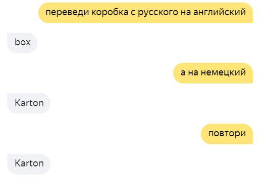

# demo-alice-translate-skill


## Что это такое

В этом репозитории - пример простого навыка Алисы 
["Крот-полиглот"](https://dialogs.yandex.ru/store/skills/622af903-krot-poliglot)
, реализованного на Python с использованием 
[новых фич](https://yandex.ru/blog/dialogs/vesennee-obnovlenie-platformy-dialogov) 
[Яндекс.Диалогов](https://dialogs.yandex.ru/) -  [грамматик](https://yandex.ru/dev/dialogs/alice/doc/nlu-docpage/) и 
[хранилища состояний](https://yandex.ru/dev/dialogs/alice/doc/session-persistence-docpage/). 
Подробнее про эти фичи можно посмотреть в 
[видеоразборе обновлений платформы](https://www.youtube.com/watch?v=VLza91oQZDA&feature=youtu.be).

Навык занимается переводом слов и фраз между несколькими языковыми парами, 
используя API Яндекс.Переводчика, и немножко может поддерживать контекст диалога:



Навык предназначен для публикации на 
[Yandex Cloud Functions](https://cloud.yandex.ru/docs/functions/) 
(для навыков Алисы это бесплатно, но нужно привязать карту). 
Впервые он был представлен на "Хакатоне 0 марта" 
([объявление](https://events.yandex.ru/events/hakaton-navykov-29-02-2020), 
[результаты](https://yandex.ru/blog/dialogs/kak-proshel-fevralskiy-khakaton)).

## Уровень 1: как запустить навык самостоятельно

1. Зарегистрироваться в [Яндекс.Облаке](https://console.cloud.yandex.ru/) 
и, следуя [инструкции](https://cloud.yandex.ru/docs/functions/quickstart/function-quickstart), 
создать функцию на `python37-preview`
1. Получить доступ к переводчику.
   1. ~~Зарегистрироваться в [API Яндекс.Переводчика](https://yandex.ru/dev/translate/)
и получить токен доступа. Вставить его в переменную API_KEY в файле `translation.py`.~~
   *Увы, этот способ больше не поддерживается Яндексом - он не выдаёт новых ключей.*
   1. Создать в Яндекс.Облаке 
   [сервисный аккаунт](https://cloud.yandex.ru/docs/iam/quickstart-sa)
   и на следующем шаге выбрать его при создании функции. 
   Тогда токен для доступа к переводчику будет передаваться прямо в функцию.
   Да, перевод с его использованием будет стоить денег - но очень небольших, 
   меньше копейки за один запрос 
   (посчитать можно в [тарифах Облака](https://cloud.yandex.ru/prices)). 
   Это действие можно пропустить, но тогда и перевода не будет.
3. В редакторе кода этой функции создать файлы `main.py`, `translation.py`,
`utils.py` и `requirements.txt`, 
и скопипастить в них содержимое соответстующих файлов из данного репозитория.
4. В поле "точка входа" в редакторе функции ввести `main.handler` - это имя
файла и питонячьей функции, которая собственно будет отвечать на запрос. 
5. В [консоли разработчика навыков](https://dialogs.yandex.ru/developer/)
создать новый навык, выбрав в качестве бэкенда "Функция в Яндекс.Облаке" и 
указав созданную вами функцию. 
Нужно также поставить галочку "использовать хранилище данных в навыке".
6. На подвкладке "Интенты" нужно накликать 4 новых интента. 
В каждом из них нужно ввести название и id, равные имени файлов `.grammar` 
(без расширения) из папки grammars, 
а в поле "грамматика" скопипастить содержимое этого файла. 
Например, в интент с названием и ID `exit` нужно скопипастить содержимое файла
`grammars/exit.grammar`.
Подробнее про интенты и сущности можно почитать в 
[документации](https://yandex.ru/dev/dialogs/alice/doc/nlu-docpage/).
7. На этой же подвкладке "Интенты" под заголовком "Сущности" надо нажать 
"Редактировать".
В открывшееся окно скопируйте содержимое файла `grammars/entities.vocab`.
8. Всё готово! Вы можете протестировать навык во вкладке "тестирование". 
Если вас всё устраивает, можно выкатить навык 
в [приватном](https://yandex.ru/dev/dialogs/alice/doc/access-docpage/) виде 
(чисто для себя и самых близких друзей), 
либо пройти модерацию (это может занять время) и опубликовать его в каталоге.

## Уровень 2: работа с логами
1. Чтобы улучшать навык, необходимо постоянно анализировать его работу, а значит, 
иметь полные данные о запросах в навык и его ответах. 
Для иерархических документов типа этих хорошо подходят noSQL базы данных типа Mongo.
Я предлагаю вам зарегистрироваться на cloud.mongodb.com и выбрать бесплатный план 
на 500 мегабайт. Для не очень популярного навыка этого хватит надолго.
2. Создав аккаунт и кластер на cloud.mongodb.com, вам нужно на вкладке 
"Database Access" создать имя пользователя БД и пароль к нему.
3. На вкладке "Network Access" нужно добавить в whitelist IP `0.0.0.0/0`, чтобы
Яндекс.Облако могло ходить в Монгу с любого IP.
4. После этого на вкладке "Clusters" нужно нажать "Connect", 
выбрать "Connect your application", потом "Python 3.6 or later". 
Сервис сформирует для вас адрес вида 
`mongodb+srv://<username>:<password>@krot-khtpt.mongodb.net/<dbname>?retryWrites=true&w=majority`.
Вместо `<username>` и `<password>` вам нужно вставить лоин и пароль из шага 2.
Вместо `<dbname>` придумайте название базы данных, куда вы хотите писать логи. 
5. Скопируйте полученный адрес и откройте редактор вашей функции в Яндекс.Облаке.
Внизу (под окошком с файлами и кодом) создайте переменную окружения 
с ключом `MONGODB_URI` и значением, равным этому адресу базы данных. 
Сохраните функцию.
6. Убедитесь, что навык запускается и корректно отвечает на запросы. 
7. Вернитесь в cloud.mongodb.com и на вкладке "Clusters" нажмите "Collections".
Вы увидите, что в созданной вами базе данных появилась таблица `logs`.
Каждая запись в такой таблице - это запрос в навык и его ответ. 
8. Собственно анализ логов можно проводить также в Python. 
Например, можно воспользоваться популярной библиотекой `pandas` для анализа данных.
```python
# !pip install pandas pymongo dnspython
import pandas as pd
import pymongo
client = pymongo.MongoClient(MONGODB_URI)  # тут должен быть ваш адрес mongo
db = client.get_default_database()
docs = pd.DataFrame(db.get_collection('logs').find())
# пример анализа: получаем топ 50 запросов по популярности
docs.utterance.value_counts().head(50)
```
Другой пример: просмотр сообщений из одной случайно выбранной сессии.
```python
docs['session_id'] = docs.request.apply(lambda x: x['session']['session_id'])
session_ids = docs['session_id'].drop_duplicates()
docs.loc[
    docs['session_id'] == session_ids.sample(1).iloc[0]
].sort_values(
    'time'
).loc[
    :, ['utterance', 'response_text']
]

```

## Уровень 3: Continuous integration
1. При каждом изменении навыка копипастить все файлы вручную - неудобно. 
К тому же, это чревато багами.
Чтобы избежать этого, можно настроить деплой кода навыка в Яндекс.Облако
автоматически из гитхаба после того, как код пройдёт тесты. 
Если вы склонировали себе этот репозиторий на гитхабе, у вас уже почти всё готово:
на каждый коммит должны пытаться запуститься две задачи, `test` и `deploy`
из файла `.github/workflows/main.yaml`.
2. Пара примеров юнит-тестов есть в файле `test_all.py`. 
Конечно, они не покрывают работу всего навыка, а лишь служат как примеры.
К моменту публичного релиза навыка постарайтесь покрыть тестами 
все важные сценарии в нём.
3. После прохождения тестов можно релизить код в Облако, воспользовавашись
для этого 
[готовым экшном](https://github.com/Goodsmileduck/yandex-serverless-action)
от Стаса Серебренникова. 
Чтобы он заработал, надо в вашем репозитории на гитхабе перейти 
на вкладку "Settings" и на подвкладке "Secrets" создать четыре секрета:
   - `TOKEN` - токен для доступа к Облаку, полученный по 
   [ссылке](https://oauth.yandex.ru/authorize?response_type=token&client_id=1a6990aa636648e9b2ef855fa7bec2fb) 
   - `FUNCTION_ID` - id вашей функции в Облаке
   - `SERVICE_ACCOUNT` - id вашего сервисного аккаунта на Яндекс.Облаке (без этого не подключится переводчик). ID - это именно автоматически сгенерированный Яндексом айдишник сервисного аккаунта, а не то человекочитаемое название, которое вы ему дали.
   - `MONGODB_URI` - адрес подключения Mongo для сохранения логов. 
   Из этой переменной придётся исключить знаки равенства, 
   иначе в каком-то месте экшна синтаксис ломается.

